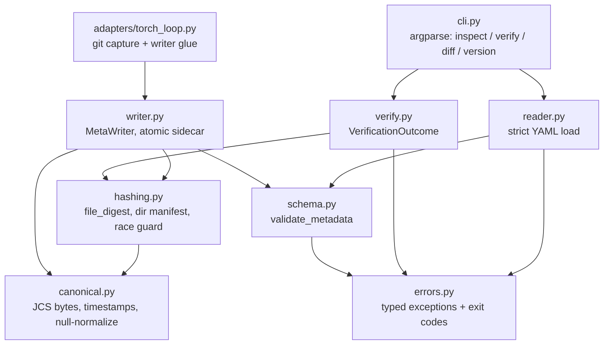

# modelmeta — system architecture (v0.1)

**Status:** Implemented v0.1 architecture, maintained against the shipped `0.1.0` package. Updated 2026-09-03. The code and tests are authoritative when this document drifts.
**Principles:** offline-first; stdlib-first; two runtime deps (PyYAML, rfc8785); dict-native data model; fail closed; deterministic bytes; never follow paths read from sidecar contents.

## 1. Component graph

Dependency arrows point downward only. No cycles. The optional `adapters/` boundary lazily imports the writer and never imports PyTorch at module load time.

## 2. Data model

The sidecar **is** a JSON-shaped mapping. Internally everything is plain dicts/lists/scalars — no ORM, no pydantic. Rationale: the artifact is a mapping; dict-in/dict-out keeps the API honest, diffable, and dependency-light.

- `schema.py::validate_metadata(raw: Mapping) -> dict` returns a deep-copied, validated structure or raises `SchemaError` with dotted-path messages (`training.loss: expected number`). Unknown sections are preserved verbatim and never validated.
- Required-field presence is checked **before** null-normalization so an explicit `null` can never satisfy a required field.
- Caller dictionaries passed to `MetaWriter` are deep-copied on ingest; the writer never mutates caller state.

## 3. Module contracts

### errors.py
Single hierarchy, each class carrying its stable exit code:

| Exception | Exit code | Raised when |
|---|---:|---|
| `ModelMetaError` | — | base |
| `SchemaError` | 11 | validation failure, duplicate keys, anchors/aliases, parse error, size cap |
| `UnsupportedSchemaError` | 13 | unrecognized `schema_version` (fail closed) |
| `UnsupportedTargetError` | 13 | symlink/socket/fifo/device target, unremovable temp files |
| `RaceDetectedError` | 14 | pre/post `(size, mtime_ns, inode)` identity changed during hashing |
| `SidecarIOError` | 14 | unwritable path, permission failures during verify |

`MissingSidecar` is a **normal outcome**, not an exception (exit 10), because it is an expected state of the world.

### canonical.py
- `normalize(obj)` — recursively removes explicit `None` values (spec §7.2: optional-null ≡ omission).
- `canonical_bytes(obj) -> bytes` — `rfc8785.dumps(normalize(obj))`; NaN/Inf raise.
- `utc_now() -> str` — exact `YYYY-MM-DDTHH:MM:SSZ`.
- Used by: directory-manifest digest, semantic diff equality, future signing payload (kept extractable per spec §19.7).

### schema.py
- `SCHEMA_VERSION = "0.1"`; regex constants for sha256 (`^[0-9a-f]{64}$`) and timestamp.
- `validate_checkpoint_section`, `validate_metadata` — pure functions, no I/O.
- Secret denylist guard lives here: recursive key scan of caller-supplied sections against `(?i)(token|secret|password|api[_-]?key)` → `ValueError`. Documented as a caller-input safety check, not complete detection (spec §13).

### detect.py
- `detect_accelerators() -> dict` performs best-effort visibility detection across supported torch backends, vendor SMI tools, and allocation environment variables without importing torch at module load time.
- Detection is informational, never a utilization measurement. `MetaWriter` uses it only when the caller has not declared accelerator count/type.

### hashing.py
- `FileIdentity = tuple[size, mtime_ns, inode, dev]` via `os.lstat` (lstat also catches symlink substitution mid-flight).
- `hash_file(path) -> DigestResult(hex, elapsed_s, manifest=None)`:
  - reject non-regular/symlink targets (`UnsupportedTargetError`);
  - `hashlib.file_digest(open(path,'rb'), "sha256")` — 256 KiB internal buffer, no mmap;
  - identity snapshot before open and after close; mismatch → `RaceDetectedError`.
- `hash_directory(path, sidecar_name) -> DigestResult`:
  - orphaned `<sidecar_name>.tmp*` removed first; failure to remove → `UnsupportedTargetError`;
  - walk with `os.walk(followlinks=False)`; symlinks/non-regular entries rejected;
  - exclusions by exact rule: reserved sidecar name + `<sidecar>.tmp*` prefix — nothing else;
  - entries sorted by UTF-8 bytes of relative POSIX path;
  - manifest `{"files": [{"path","sha256","size_bytes"}...]}`; digest = SHA-256 of `canonical_bytes(manifest)`;
  - per-file identity re-checked after full walk (2N stats, negligible vs hashing).
- DigestResult carries the manifest for `inspect`.

### reader.py
- `load_sidecar(path) -> dict`: size cap 4 MiB → bytes → `yaml.load(_StrictLoader)`.
- `_StrictLoader(yaml.SafeLoader)`: duplicate-key rejection via `construct_mapping` override; anchors/aliases rejected in `compose_node`; both raise `ConstructorError`, surfaced as `SchemaError`.
- Reader returns raw parsed dict; normalization is canonical's job. Reader never resolves `checkpoint.path`.

### writer.py
- `MetaWriter(run_context=None)`; `on_checkpoint_saved(checkpoint_path, *, training_state=None, compute_state=None, lineage=None, optimizer_state=None) -> str`.
- Sequence (spec §8): validate path (reject `*.modelmeta.yaml.tmp*` targets) → hash → build metadata (deep-copied inputs, secret guard, `created_at=utc_now()`) → validate → dump YAML deterministically (`sort_keys=True, default_flow_style=False, allow_unicode=True, width=10**6`) → mkstemp same dir → write → flush → fsync → close → `os.replace` (retry ×3 backoff on Windows `PermissionError`) → parent-dir fsync (POSIX-only, best-effort).
- `try/finally` unlinks the temp file on any failure; previous sidecar untouched. Idempotent: full replace, never merge (spec §8.1).
- A monotonic timer starts at writer creation or `reset_timer()`. When absent, `wall_hours` is elapsed wall time and `gpu_hours` is estimated as `wall_hours × accelerator_count`; explicit caller values take precedence. Hashing cost is reported via `writer.last_hash_seconds`.

### verify.py
- `verify_checkpoint(checkpoint_path) -> VerificationOutcome(status, exit_code, detail)`. Domain outcomes are returned, never raised; unexpected `OSError` maps to `io_error`.
- Status machine:

| status | exit | condition |
|---|---:|---|
| `match` | 0 | recomputed digest == sidecar digest, schema valid |
| `missing_sidecar` | 10 | no sidecar beside target |
| `invalid_schema` | 11 | structurally untrustworthy sidecar |
| `digest_mismatch` | 12 | bytes differ from recorded digest |
| `unsupported_target` / `unsupported_schema` | 13 | cannot safely hash / fail-closed version |
| `io_error` / `race_detected` | 14 | could not complete |

- Success message fixed: `checkpoint integrity verified; metadata remains self-asserted`.

### cli.py
- argparse subcommands; `--json` per subcommand. Envelope exactly per spec §10.3 (`cli_output_version: "1"`). Human and JSON streams never mix.
- `diff` loads both sidecars, compares normalized canonical forms, groups changes: training / provenance (incl. git, dataset, lineage) / compute (incl. optimizer_state) / artifact (checkpoint section). No ranking language.
- Exit code 2 reserved for usage errors (argparse default).

### adapters/torch_loop.py
- Zero torch import: `capture_git_state(repo) -> dict | None` (subprocess `git rev-parse`, soft-fail omits section) and a thin wrapper calling `MetaWriter`. It is glue, not framework integration.

## 4. Concurrency & crash semantics

- Single-writer assumption (spec §8.2): last atomic replace wins; visibility via sidecar mtime.
- Crash windows: before replace → temp file remains, excluded from future hashes and cleaned opportunistically at next directory hash; after replace → complete sidecar. No window yields a truncated *final* sidecar.
- Windows durability gap (no portable dir-fsync) documented; NTFS metadata journaling covers rename atomicity, not durability — accepted residual risk, stated in README.

## 5. Test matrix → acceptance criteria (spec §16)

| Test file | Covers |
|---|---|
| `test_canonical.py` | RFC 8785 App. B vectors; `1e-08`→`1e-8`; NaN/Inf reject; null-normalization; timestamp format |
| `test_schema.py` | required/optional fields; uppercase-sha256 rejection; unknown-section preservation; secret-key guard |
| `test_hashing.py` | known SHA-256 vectors; empty file; dir determinism across insertion order; exclusion rules; orphan-temp removal; symlink/fifo rejection (POSIX-gated); race injection via `os.utime` |
| `test_writer.py` | happy path; idempotent replace; caller-dict immutability; injected `os.replace` failure leaves old sidecar + no temp; fsync call ordering; temp-target rejection |
| `test_reader.py` | dup keys; anchor/alias bombs; size cap; malformed YAML |
| `test_verify.py` | all six statuses incl. byte-flip → 12; lying `checkpoint.path` ignored (security); directory roundtrip |
| `test_cli.py` | envelope shape/stability; exit codes via `SystemExit`; human/JSON separation; diff grouping |
| `test_large_sparse.py` | sparse multi-GiB file (POSIX-gated, marked `slow`) — acceptance #9 |

Acceptance #4 (kill during write) is covered by fault injection at each writer step, not real SIGKILL loops.

## 6. Performance budget

- Hashing: disk-bound; ~2–3 GB/s compute ceiling (SHA-NI). Documented, not optimized further in v0.1.
- Memory: O(256 KiB) streaming buffer; directory manifests held in RAM (proportional to file count, not bytes).
- Sidecar size: <100 KiB for realistic inputs; reader cap 4 MiB.

## 7. Repository & workflow

- Branching: `main` (releases/docs) ← `dev` (integration) ← `feat/*`. Merges `--no-ff`. Push all three tiers.
- Hooks: `.githooks/pre-commit` (ruff + mypy + fast unit) and `.githooks/pre-push` (full suite incl. slow marks); activated via `git config core.hooksPath .githooks`. Local enforcement only (spec §17).
- Packaging: hatchling; `requires-python >=3.11`; deps `PyYAML>=6.0.3,<7`, `rfc8785>=0.1.4,<2`; `py.typed` shipped; dev extra: pytest, pytest-cov, ruff, mypy.
